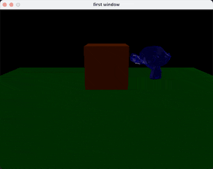
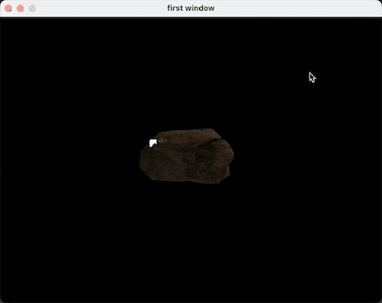

# MicroRenderer

A self-built soft Rasterizer, called Micro(soft)Renderer.

## feature
- [x] Triangle Rasterization(line mode and fill mode)
- [x] linear and barycentric interpolation
- [x] Z-buffering
- [x] mvp transformation
- [x] load model
- [x] Gouraud shading phong shading

## dependencies
1. SDL2
2. stb_image
3. glm
4. assimp

## current stage showcase

